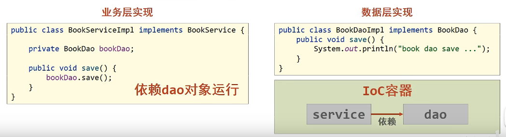
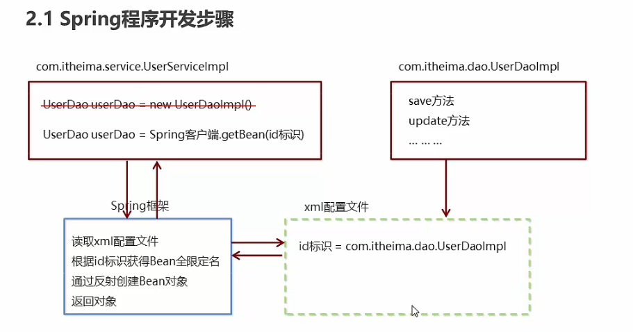
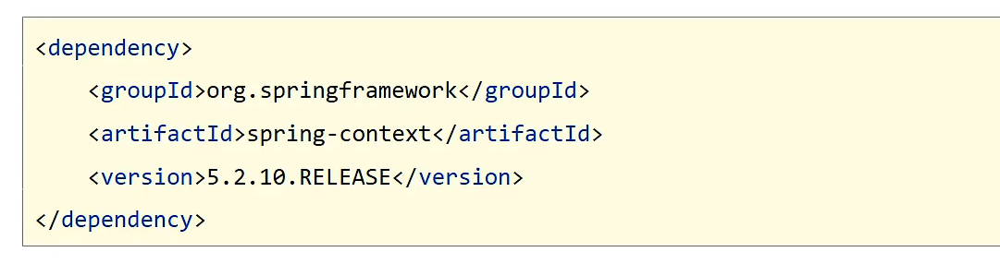
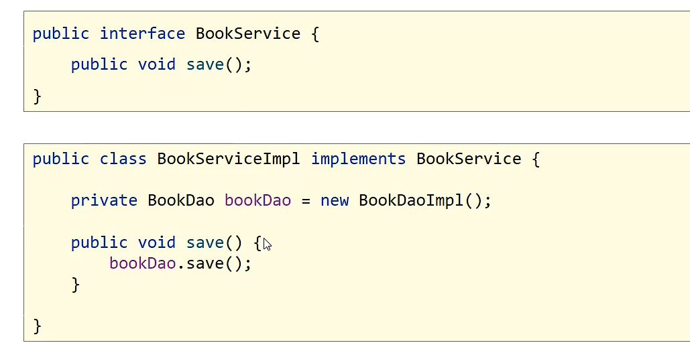
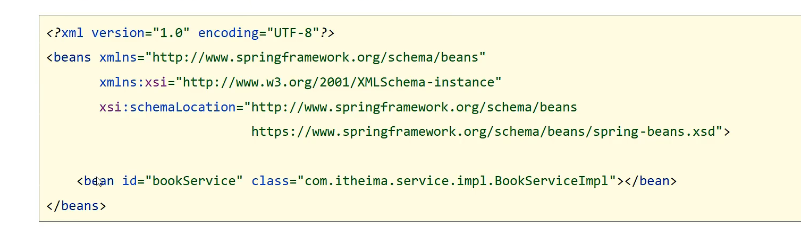
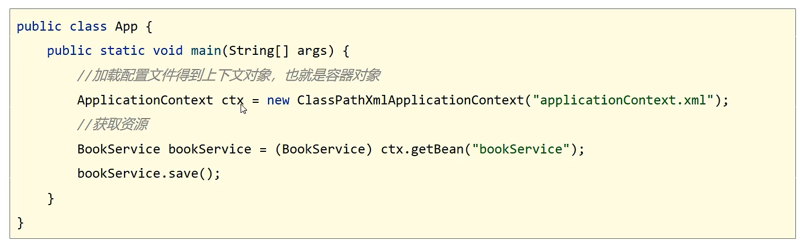
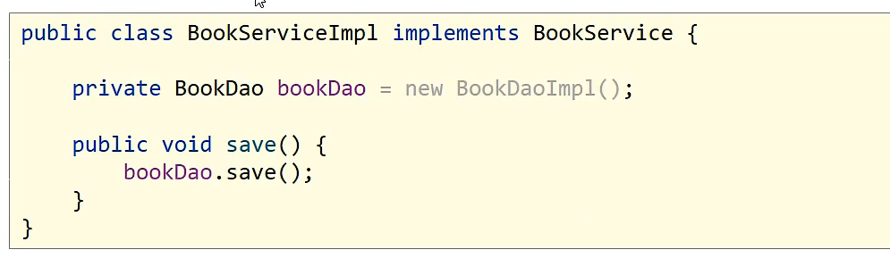
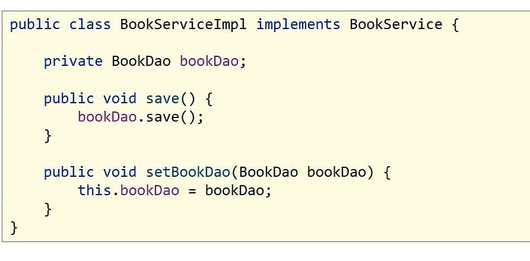
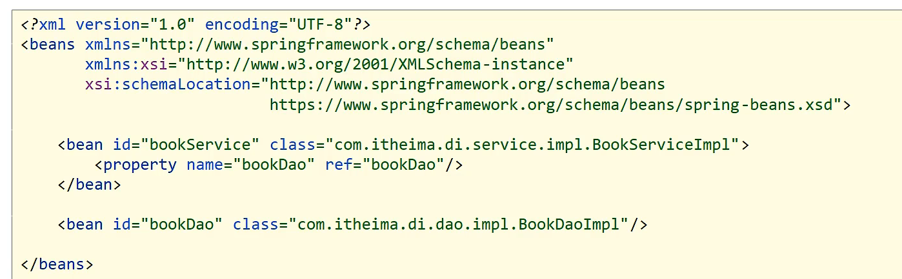
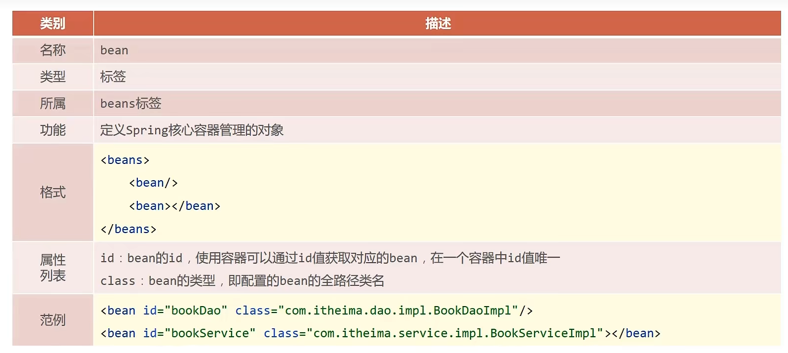

## 核心概念

+ 代码书写现状
  + 耦合度偏高
+ 解决方案
  + 使用对象时，在程序中不要主动使用new产生对象，转换为由外部提供对象
+ IoC(Inversion of Control)控制反转
  + 对象的创建控制权由程序转移到外部，这种思想称为控制反转

### IoC(Inversion of Control)控制反转

+ 使用对象时，由主动new产生对象转换为由**外部**提供对象，此过程中对象创建控制权由程序转移到外部，此思想称为控制反转
+ **Spring技术对IOC思想进行了实现****
  + Spring技术提供了一个容器，称为Ioc容器，用来充当Ioc思想的”外部“
  + IoC容器负责对象的创建、初始化等一系列工作，被创建或被管理的对象在IoC容器中统称为**Bean**
+ **DI（Dependency Injection）依赖注入**
  + 在容器中建立bean与bean之间的依赖关系的整个过程，称为依赖注入

+ 目标：**充分解耦*
  + 使用IoC容器管理bean（IoC）
  + 在IoC容器内将有依赖关系的bean进行关系绑定（DI）
+ 最终效果
  + 使用对象时不仅可以直接从IoC容器中获取，并且获取到的bean已经绑定了所有的依赖关系

## Spring程序开发步骤

1. 导入Spring开发的基本包类
2. 编写Dao接口和实现类
3. 创建Spring核心配置文件
4. 在Spring配置文件中配置UserDaoImpI
5. 使用Spring的API获得Bean实例

## Spring快速入门知识点

### IOC入门案例思路分析

1. 管理什么？（Service与Dao）
2. 如何将被管理的对象告知IoC容器？（配置）
3. 被管理的对象交给IoC容器，如何获取到IoC容器？（接口）
4. IoC容器得到后，如何从容器中获取bean？（接口方法）
5. 使用Spring导入坐标？（pom.xml）

+ IOC入门案例

  1. 导入坐标

     

  2. 定义Spring管理的类（接口）

     

  3. 创建Spring的配置文件，配置对应类作为Spring管理的bean【applicationContext.xml】

     

     > bean定义时id属性在同一个上下文不能重复

  4. 初始化Ioc容器（Spring核心容器/Spring容器），通过容器获取bean

     

### DI入门案例思路分析

1. 基于IoC管理bean 
2. Service中使用new形式创建的Dao对象是否保留?（否）
3. Service中需要的Dao对象如何进入到Service中？（提供方法）
4. Service与Dao间的关系如何描述？（配置）

### DI入门案例（XML版）

1. 删除使用new的形式创建对象的代码

   

2. 提供依赖对象对应的setter方法

   

3. 配置service与dao之间的关系

   

## Bean基础配置

